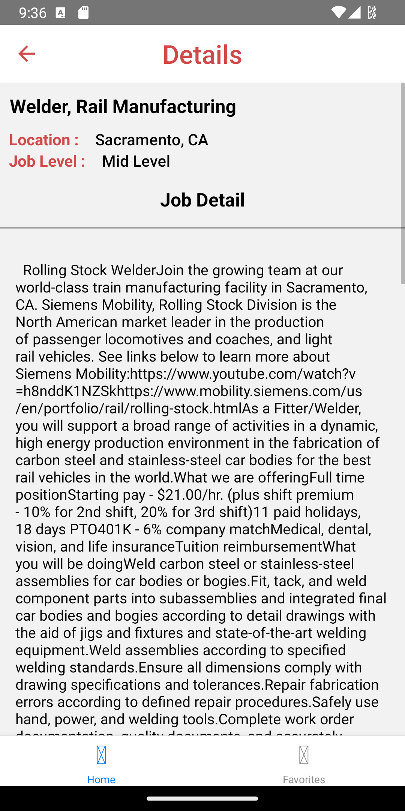

Hello,
Let me show you the Kodwork App. This is kind of a employment app that find jobs, submit and add to favorite page to them. 
I use Redux to create Favorites page. I am not completaly understand what is going on in that but i still working on it. Just see how it works and how can i use in a project other than Counter :D.

HTML

